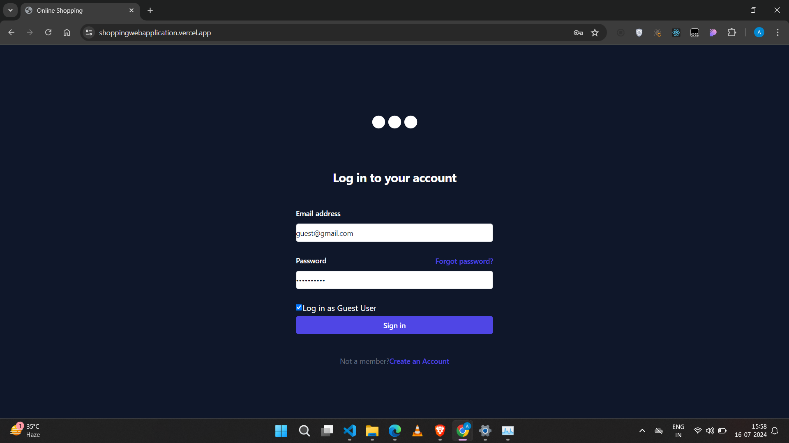
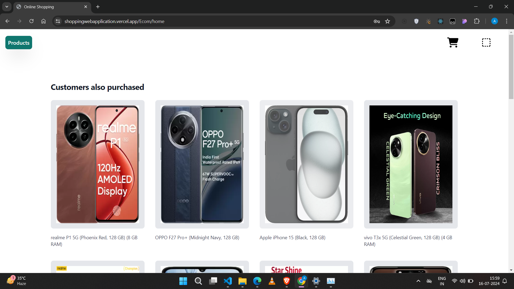
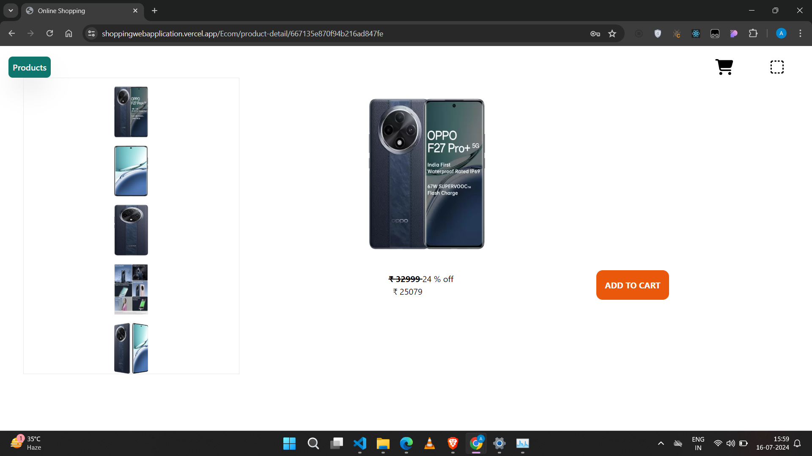
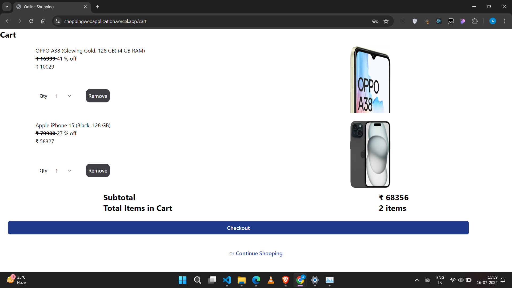
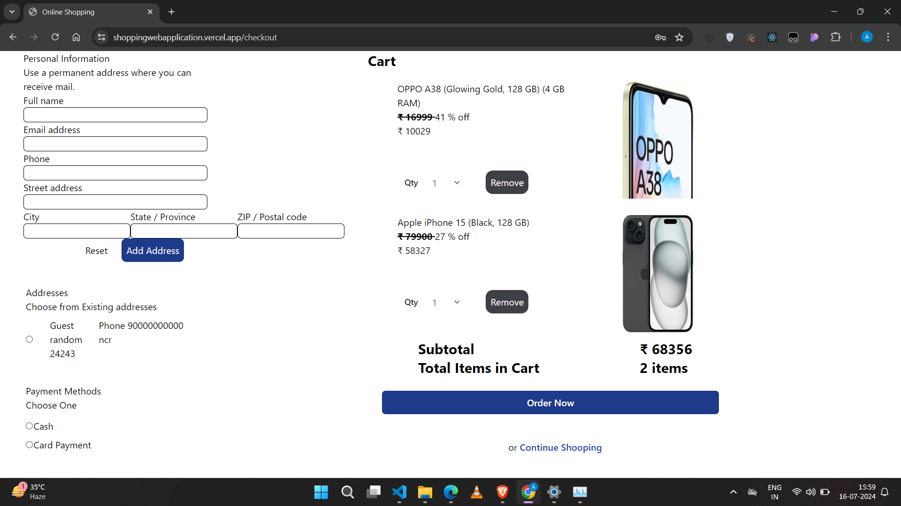
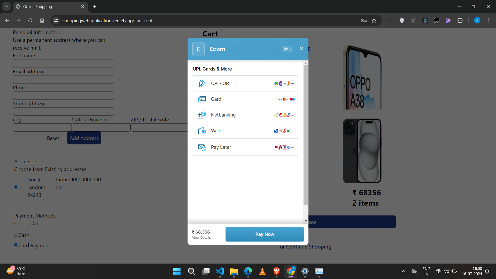
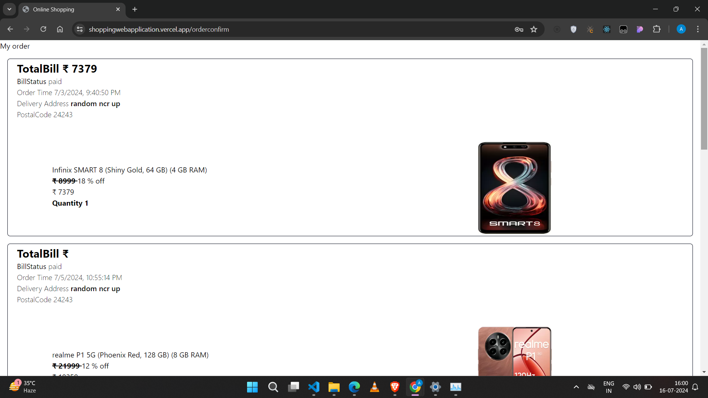

# Shopping Application #
[project-live](https://shoppingwebapplication.vercel.app/)
   - - - -
 # Technology used in this project #
  
  
  

  
  

  

   

   - - - - 
* Skill Gained in this project
  * In this project, I learned how to __design schemas and write controllers__ for APIs, ensuring efficient and organized data management.
  * I learned how to connect the frontend with the backend, including the __use of CORS to handle cross-origin requests__.
  * I utilized Redux for managing the application's state, enabling efficient data flow across different components using __useSelector and useDispatch__
  * I developed __custom hooks__ to encapsulate and reuse logic across various parts of the application.
  * I also learned how __routing works and how to navigate from one route to another__ by performing some operations using navigate.
  __navigate__ 
 
  

  
  

 
 ## Destop view ##
 
  
 
 
 
 
 
 

  
   